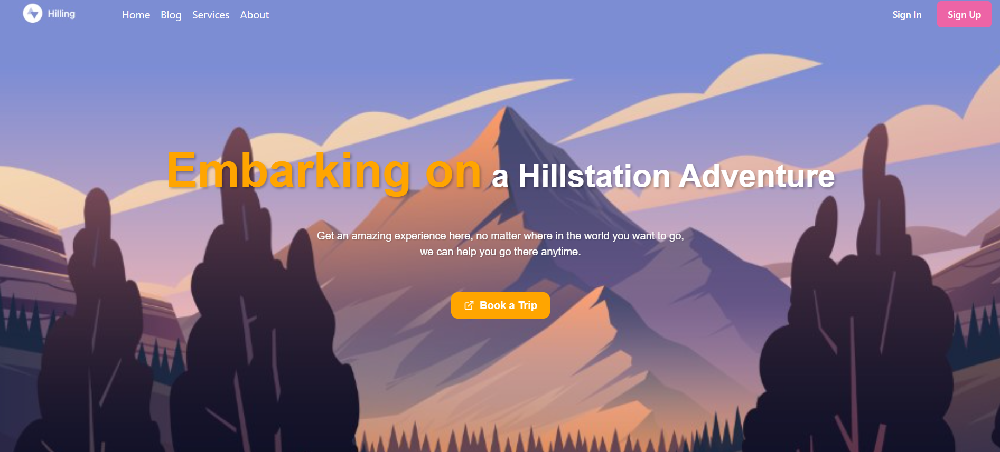
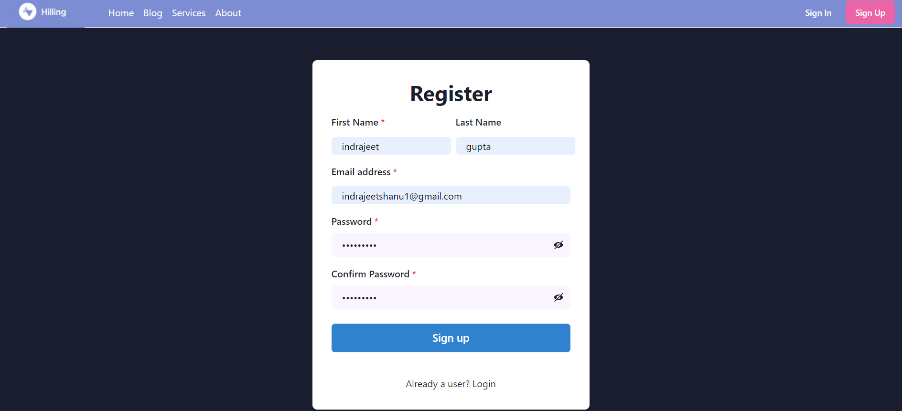
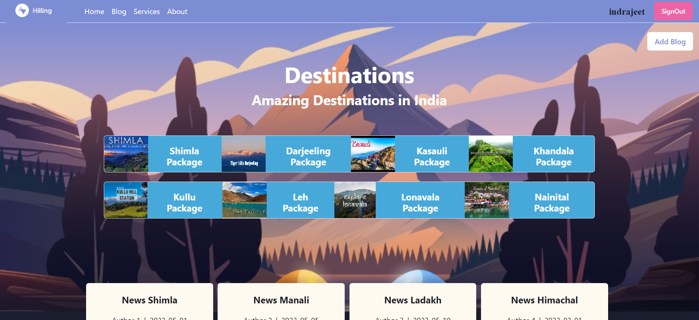
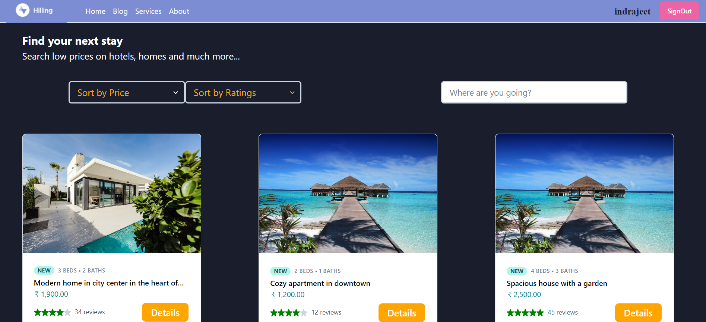
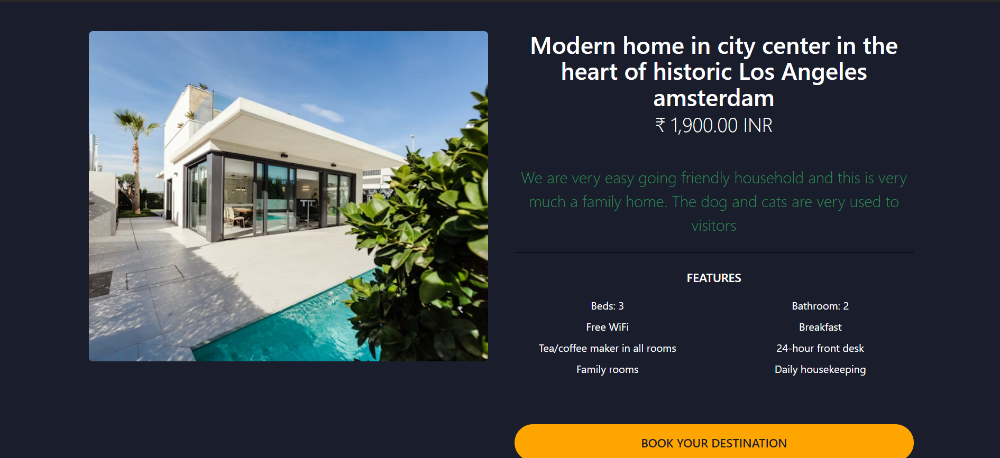
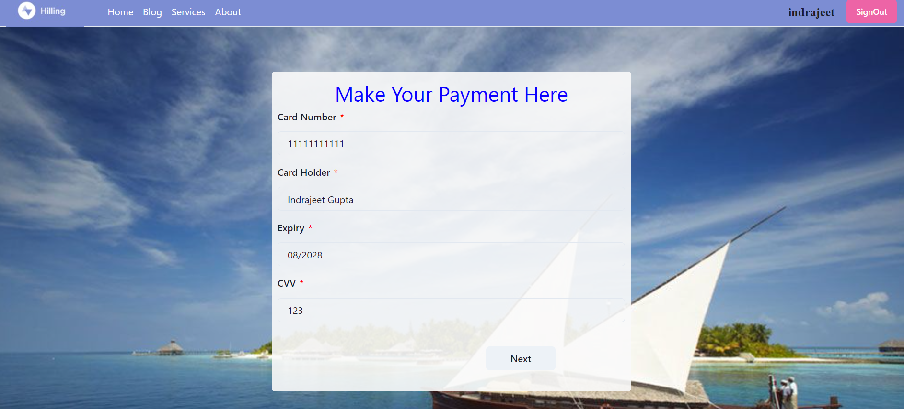

<h1>Tarval--HillStation</h1>

## Content as follow :-
- `Home page`

- `Signin/Signup page`

- `Blog page`

- `Service page`

- `Detail page`

- `Payment page`

 ##  Home page
 As soon as user visit the project you will see our landing page with all kind of navigation like Blog,Services,signup,About us etc.
 #### This is how our home page looks like:-

## Sign In page
As simple as you sign in to other website if you already sign in then no need to sign up...
#### Sign up page! 

 ## Blog page
 If user want to add some blog first he/she have to click on add blog. 
 #### Glance over it :-

 ## Service page
 If you want to know more about service you just have to click on it and you will encounter with the Service page which looks like this :-

 ## Service detail page
 If you want to know more about or want to book a Service you just have to click on it and you will encounter with the detail page which looks like this :-

## Payment page
After you click on proceed to payment on cart page you will see a payment gateway where you have to enter your card detail like card no., cvv etc.

